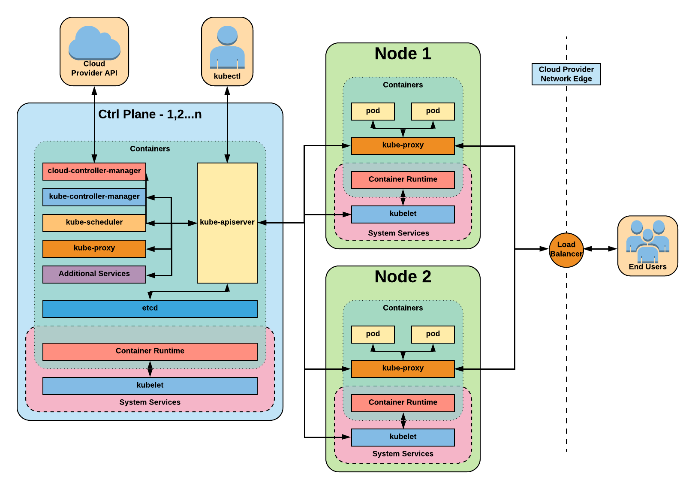

# Diagrams

Collection of Images and Diagrams from talks and presentations. Made available under the [Creative Commons Attribution Licence](https://creativecommons.org/licenses/by/4.0/) for reuse.

---
* [Kubernetes](#Kubernetes)
  * [Architecture](#architecture)
  * [CNI Overview](#CNI-Overview)
  * [CNI Overview-Example](#CNI-Overview-Example)
  * [Pod](#Pod)
  * [Pod Label](#Pod-Label)
  * [Pod Selector Example](#Pod-Selector-Example)
  * [Workloads to Pod](#Workloads-to-Pod)
  * [Deployment Simple Part1](#Deployment-Simple-Part1)
  * [Deployment Detailed Part1](#Deployment-Detailed-Part1)
  * [Deployment Simple Part2](#Deployment-Simple-Part2)
  * [Deployment Detailed Part2](#Deployment-Detailed-Part2)
  * [Deployment Simple Part3](#Deployment-Simple-Part3)
  * [Deployment Detailed Part3](#Deployment-Detailed-Part3)
  * [Deployment Simple Part4](#Deployment-Simple-Part4)
  * [Deployment Detailed Part4](#Deployment-Detailed-Part4)
  * [Deployment Simple Part5](#Deployment-Simple-Part5)
  * [Deployment Detailed Part5](#Deployment-Detailed-Part5)
  * [Deployment Simple Part6](#Deployment-Simple-Part6)
  * [Deployment Detailed Part6](#Deployment-Detailed-Part6)
  * [Service ClusterIP Simple](#Service-ClusterIP-Simple)
  * [Service ClusterIP Detailed](#Service-ClusterIP-Detailed)
  * [Service NodePort Simple](#Service-NodePort-Simple)
  * [Service NodePort Detailed](#Service-NodePort-Detailed)
  * [Service LoadBalancer Simple](#Service-LoadBalancer-Simple)
  * [Service LoadBalancer Detailed](#Service-LoadBalancer-Detailed)
  * [PVC to PV](#PVC-to-PV)
  * [StorageClass](#StorageClass)
  * [Creation of a Pod Part1](#Creation-of-a-Pod-Part1)
  * [Creation of a Pod Part2](#Creation-of-a-Pod-Part2)
* [Vault](#Vault)
  * [Vault AWS Workflow](#Vault-AWS-Workflow)

---

## Kubernetes

**Architecture**

**CNI Overview**

**CNI Overview Example**

**Pod**

**Pod Label**

**Pod Selector Example**

**Workloads to Pod**

**Deployment Simple Part1**

**Deployment Detailed Part1**

**Deployment Simple Part2**

**Deployment Detailed Part2**

**Deployment Simple Part3**

**Deployment Detailed Part3**

**Deployment Simple Part4**

**Deployment Detailed Part4**

**Deployment Simple Part5**

**Deployment Detailed Part5**

**Deployment Simple Part6**

**Deployment Detailed Part6**

**Service ClusterIP Simple**

**Service NodePort Simple**

**Service LoadBalancer Simple**

**Service ClusterIP Detailed**

**Service NodePort Detailed**

**Service LoadBalancer Detailed**

**PVC to PV**

**StorageClass**

**Creation of a Pod Part1**

**Creation of a Pod Part2**

---

## Vault

**Vault AWS Workflow**

